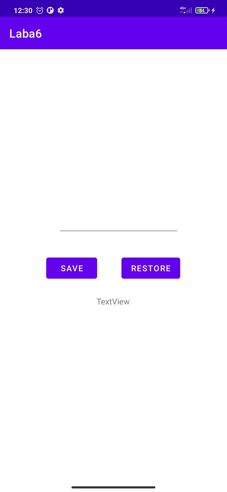

Отчет по лабораторной работе №6

1. Создание проекта
                                                                                                                                                                  
2.Добавить поле EditText тип textMultiLine
                                                                                                                                                                         
3. Добавить 2 кнопки – Получить данные и сохранить данные и
создать для них обработчики событий

                                                                                                                                                                 
4. 
```java
public void restoreField(View view)
{
TextView nameView = (TextView) findViewById(R.id.saveTextView);
nameView.setText(name);
}
```
5. public void saveField(View view)
{
TextView nameBox = (TextView)
findViewById(R.id.editTextTextMultiLine);
name = nameBox.getText().toString();
}


                                                                                                                                                                          
6. Добавить поле TextView
                                                                                                                                                                           
7. Добавим в них код

8. public class MainActivity extends AppCompatActivity
{
String name =&quot;неопределено&quot;;
final static String nameVariableKey = &quot;NAME_VAR&quot;;
final static String textViewTexKey = &quot;TEXT_VIEW&quot;;
@Override
protected void onCreate(Bundle savedInstanceState)
{
super.onCreate(savedInstanceState);
setContentView(R.layout.activity_main);
}
@Override
protected void onSaveInstanceState(Bundle outState)
{
outState.putString(nameVariableKey, name);
TextView nameView = (TextView) findViewById(R.id.saveTextView);

outState.putString(textViewTexKey,
nameView.getText().toString());
super.onSaveInstanceState(outState);
}
@Override
protected void onRestoreInstanceState(Bundle savedInstanceState)
{
super.onRestoreInstanceState(savedInstanceState);
name = savedInstanceState.getString(nameVariableKey);
String textViewText=
savedInstanceState.getString(textViewTexKey);
TextView nameView = (TextView) findViewById(R.id.saveTextView);
nameView.setText(textViewText);
}
}

Итог:
package com.example.laba6;

import androidx.appcompat.app.AppCompatActivity;

import android.os.Bundle;
import android.view.View;
import android.widget.TextView;

public class MainActivity extends AppCompatActivity {
    String name ="неопределено";
    final static String nameVariableKey = "NAME_VAR";
    final static String textViewTexKey = "TEXT_VIEW";
    @Override
    protected void onCreate(Bundle savedInstanceState) {
        super.onCreate(savedInstanceState);
        setContentView(R.layout.activity_main);
    }

    public void restoreField(View view)
    {
        TextView nameView = (TextView) findViewById(R.id.saveTextView);
        nameView.setText(name);
    }

    public void saveField(View view)
    {
        TextView nameBox = (TextView)
                findViewById(R.id.editTextTextMultiLine);
        name = nameBox.getText().toString();
    }

    @Override
    protected void onSaveInstanceState(Bundle outState)
    {
        outState.putString(nameVariableKey, name);
        TextView nameView = (TextView) findViewById(R.id.saveTextView);

        outState.putString(textViewTexKey,
                nameView.getText().toString());
        super.onSaveInstanceState(outState);
    }
    @Override
    protected void onRestoreInstanceState(Bundle savedInstanceState)
    {
        super.onRestoreInstanceState(savedInstanceState);
        name = savedInstanceState.getString(nameVariableKey);
        String textViewText=
                savedInstanceState.getString(textViewTexKey);
        TextView nameView = (TextView) findViewById(R.id.saveTextView);
        nameView.setText(textViewText);
    }
}

Итог:
                                 
